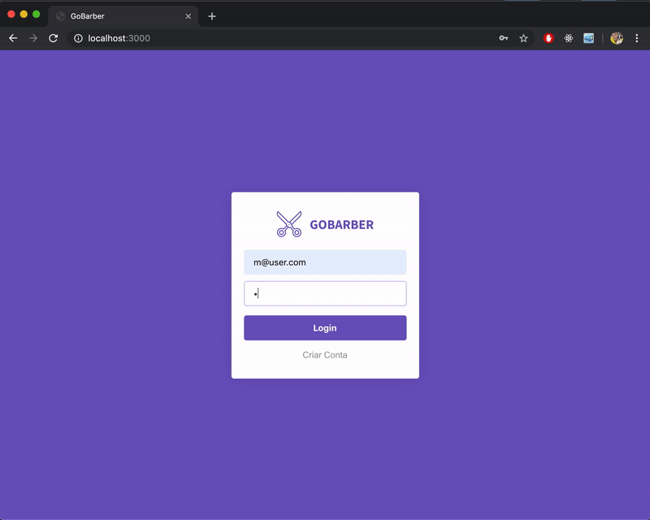

# Instalação

- rode um npm install ou yarn para a instalação das dependencias.

- entre: src/config/database.js e altere os campos de conexaão com o DB
  -- pode usar o docker para subir um container em postgres:

```
docker run --name database -e POSTGRES_PASSWORD=docker -p 5432:5432 -d postgres
```

- rode as migrações das tabelas do banco

```
yarn sequelize db:migrate
```

- rode yarn start e va para localhost:3000


